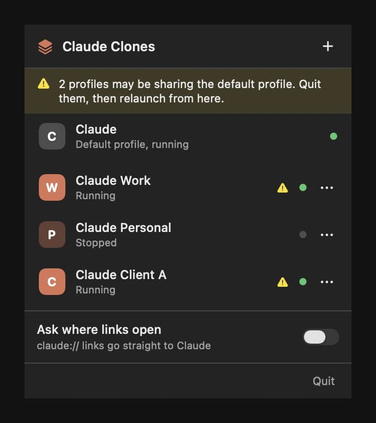
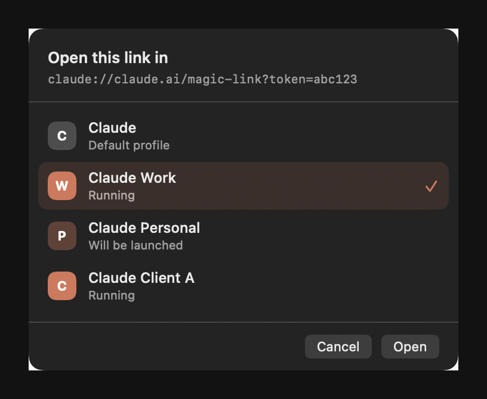
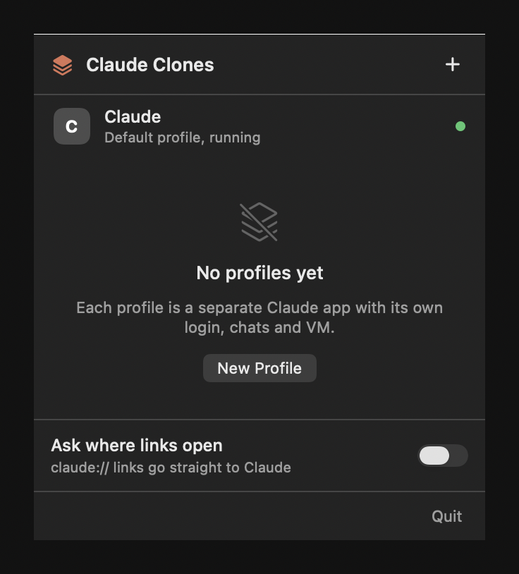

# Claude Clones: run multiple Claude Desktop accounts side by side on macOS

[](https://github.com/hudiohizari/claude-desktop-multi-account/actions/workflows/ci.yml)

[](LICENSE)

Claude Desktop signs in one account at a time, so switching between a work account
and a personal one means logging out and back in, losing your MCP servers and any
running Cowork task with it. **Claude Clones** is a small macOS menu bar app that
gives every account its own Claude Desktop app, running at the same time, each with
its own login, chats, MCP servers and Cowork VM.

It also takes over `claude://` links so you choose which account opens a login
callback, a shared artifact, or a `claude://resume` link from Claude Code.

No copy of Claude is made and nothing is re-signed. Every profile launches the
untouched `/Applications/Claude.app` binary, so the app keeps its Apple signature
and entitlements, which is what the Cowork VM, passkeys and Microsoft SSO depend on.



## Contents

- [Why](#why)
- [Screenshots](#screenshots)
- [Requirements](#requirements)
- [Install](#install)
- [Usage](#usage)
- [Command line](#command-line)
- [How it works](#how-it-works)
- [FAQ](#faq)
- [Troubleshooting](#troubleshooting)
- [Uninstall](#uninstall)
- [Project layout](#project-layout)
- [Development](#development)
- [Privacy](#privacy)
- [Disclaimer](#disclaimer)

## Why

If you have two legitimate Claude accounts, a personal Pro or Max subscription and a
work Team or Enterprise seat, the desktop app makes you pick one. The usual
workarounds all cost something:

| Workaround | Problem |
|---|---|
| Log out and back in | Loses MCP servers, extensions and scheduled Cowork tasks |
| Second account in a browser | No local MCP servers, no Claude Code, no Cowork |
| A second macOS user account | Fast user switching for every account change |
| A re-signed copy of Claude.app | Keychain prompts, and the Cowork VM and passkey entitlements are gone |

Claude Clones keeps one installed Claude and swaps only the profile directory.

## Screenshots

**The menu bar popover.** Each profile shows its state, and clicking a row launches
it or focuses the instance that is already running.


**Deep link routing.** When a `claude://` link arrives, pick the profile that should
open it. The instance you last used is preselected.



**Before you add anything.** The empty state explains what a profile actually is.



## Requirements

- macOS 12 or later, Apple Silicon or Intel
- [Claude Desktop](https://claude.ai/download) installed at `/Applications/Claude.app`
- Xcode command line tools, for `swiftc` (`xcode-select --install`)
- One Anthropic account per profile. This app does not provide, sell or share
  accounts.

## Install

Homebrew:

```bash
brew tap hudiohizari/claude-desktop-multi-account https://github.com/hudiohizari/claude-desktop-multi-account
brew install --cask claude-clones
```

Or from source:

```bash
git clone https://github.com/hudiohizari/claude-desktop-multi-account.git
cd claude-desktop-multi-account
./build.sh --install
open ~/Applications/"Claude Clones.app"
```

`--install` copies the app to `~/Applications` and registers it with
LaunchServices. It runs in the menu bar only, with no Dock tile.

## Usage

**Add a profile.** Click **+**, type a name, press Return. You get
`~/Applications/Claude <name>.app` with a letter badged icon, plus a profile
directory at `~/.claude-instances/clone-N`.

**Sign in.** Launch the profile and sign in. Do this **one profile at a time, with
the others quit**, because a login callback arrives as a `claude://` link and only
one app can own that scheme. Once a profile holds a token it keeps it.

**Everyday use.** Launch profiles from the popover, the Dock, Spotlight, or ⌘-Tab,
like any other app. They run simultaneously and never log each other out.

**Route links.** Turn on **Ask where links open** and the app claims `claude://`.
Every deep link then opens a chooser: `claude://resume` from Claude Code, MCP
connector OAuth callbacks, shared Cowork artifacts, magic links. Claude re-registers
itself for the scheme on every launch, so the app watches for that and quietly claims
it back. Turn the switch off to hand the scheme over for good.

**Reach the stock profile.** The first row, **Claude**, opens your original
non-clone profile. Use it rather than the Dock: while a clone is running,
LaunchServices treats that bundle id as already running, so opening Claude the usual
way just brings the clone forward. That row forces a new instance instead.

**Rename or delete.** Use the row's ••• menu. Deleting asks whether to remove the
profile too, and shows how large it is first, because that directory holds the
login, the chats and the Cowork VM.

## Command line

Everything the popover does, without the popover:

```bash
CC="$HOME/Applications/Claude Clones.app/Contents/MacOS/ClaudeClones"
"$CC" --list
"$CC" --create Work
"$CC" --rename Work Personal
"$CC" --delete Personal --with-profile
```

## How it works

Claude Desktop is an Electron app. Each clone is a tiny `.app` bundle whose
executable is a shell script that exports one variable and then `exec`s the real
Claude binary:

```bash
export CLAUDE_USER_DATA_DIR="$HOME/.claude-instances/clone-1"
exec /Applications/Claude.app/Contents/MacOS/Claude "$@"
```

Findings behind that one line, all measured on macOS 26 with Claude Desktop
1.24012.9:

- **`CLAUDE_USER_DATA_DIR` beats `--user-data-dir`.** The environment variable
  redirects `userData` *and* the log directory into the profile. The Chromium flag
  isolates the data but leaves every instance writing one shared
  `~/Library/Logs/Claude/main.log`.
- **`LSEnvironment` is unusable.** A bundle that declares it fails to launch with
  `_LSOpenURLsWithCompletionHandler() failed with error -54`, before the executable
  runs, so the variable is exported inside the script instead.
- **Never codesign a script based wrapper.** Ad-hoc signing a bundle whose main
  executable is a shell script makes launchd refuse it: `Launchd job spawn failed`,
  POSIX 162.
- **Force `arm64`.** A script has no Mach-O header for LaunchServices to read an
  architecture from, so it starts the app as `x86_64` and `exec` inherits that
  preference. Claude then runs translated under Rosetta, which renders a blank
  window and stalls the main process for seconds at a time. The wrapper sets
  `LSArchitecturePriority` to `arm64`, which Intel Macs ignore.
- **Deep links cannot be aimed with LaunchServices.** Every instance shares one
  bundle id, so a `claude://` link always reaches the *first launched* instance
  regardless of which window is in front. `open -b` against a wrapper spawns a
  duplicate process instead of delivering to the running one.
- **A `GURL` Apple Event addressed to a pid does land in that exact process.** That
  is how routing works here, and it is verified: a link sent to one clone appears in
  that clone's log while the default profile's log stays untouched.
- **Let AppKit own the incoming event.** Installing a `GURL` handler through
  `NSAppleEventManager` replaces AppKit's handler, and AppKit's is the one that
  acknowledges the event. Without the acknowledgement macOS treats the link as
  unhandled and passes it to the next app registered for `claude://`, so Claude
  opens it as well. Only `application(_:open:)` is used.
- **One process per profile.** A second process on the same profile comes up signed
  out, so the wrapper focuses the running instance rather than launching again. It
  records its pid before `exec`, and `exec` keeps the pid, so the pid file
  identifies the Claude process itself.

## FAQ

### Can I run two Claude accounts at the same time on one Mac?

Yes. Each profile is a separate process with its own window, Dock tile and ⌘-Tab
entry. Nothing logs out when you switch.

### What is isolated between profiles?

Login and OAuth tokens, cookies, chat history, MCP servers
(`claude_desktop_config.json`), extension and skill allowlists, the Cowork VM and
its disk images, window state, and logs.

### What is still shared?

The Claude binary itself, the `Claude Safe Storage` keychain key (same bundle, so no
prompts, and each instance only decrypts its own cookies), the `claude://` handler,
`~/.claude` if you use the Claude Code CLI, and your filesystem. A Cowork VM mounts
your home directory, so clones see the same files.

### Does the Cowork VM work inside a clone?

Yes, and each profile gets its own. That is the main reason this app wraps the
signed binary instead of copying it: the VM needs the
`com.apple.security.virtualization` entitlement, which an ad-hoc re-signed copy
cannot carry. Expect 1-2 GB of disk per profile once a VM is built.

### Is this allowed?

Anthropic's consumer terms permit holding more than one legitimate account, for
example work and personal. This tool is for that. It is not for stacking free
accounts to dodge usage limits, and it does not touch rate limits or billing.

### Does it work on Intel Macs?

Yes. The `arm64` architecture preference is simply ignored there.

### Why does my second profile show as number 3?

Profile ids come from the directories in `~/.claude-instances`, and an id is never
reused while a directory with that number exists, so a new profile can never be
handed a directory that already holds someone's login. Delete the leftover
directories if you want the numbering to start over.

### Does it modify Claude Desktop?

No. `/Applications/Claude.app` is never written to. Uninstalling leaves it exactly
as it was.

## Troubleshooting

**A profile's window is blank.** Check the profile's own log:

```bash
tail -f ~/.claude-instances/clone-1/Logs/main.log
```

A startup line reading `arch: 'x64'` on an Apple Silicon Mac means it is running
under Rosetta. Re-create the launcher so it picks up `LSArchitecturePriority`.

**A login link opens the wrong account.** Quit the other instances and sign in to one
profile at a time, or turn on **Ask where links open** and pick the target.

**Links are not reaching the chooser.** Claude re-registers itself for `claude://`
when it starts. Toggle **Ask where links open** off and on to claim it back.

**"Could not hand the link over".** macOS is waiting for Automation permission.
Approve Claude Clones under System Settings, Privacy and Security, Automation.

**First launch of a profile is slow.** It bootstraps a profile from nothing,
including the Cowork VM. Later launches are normal speed.

The app's own log lives at `~/Library/Logs/ClaudeClones.log`.

## Uninstall

```bash
CC="$HOME/Applications/Claude Clones.app/Contents/MacOS/ClaudeClones"
"$CC" --list                       # see what exists first
"$CC" --delete <name> --with-profile
rm -rf ~/Applications/"Claude Clones.app" ~/.claude-instances
```

If the app still owns `claude://`, turn the toggle off before removing it, so links
go back to Claude.

## Project layout

| File | Responsibility |
|---|---|
| `Clone.swift` | Value type: identity and derived paths |
| `CloneStore.swift` | `CloneStoring`, persistence in `clones.json` |
| `WrapperBuilder.swift` | `CloneProvisioning`, writes and registers the `.app`, badges its icon |
| `InstanceLocator.swift` | `InstanceLocating`, which process belongs to which profile |
| `LinkRouter.swift` | `LinkDelivering`, hands a link to one instance, plus scheme ownership |
| `CloneManager.swift` | Use cases shared by the popover and the CLI |
| `MenuBarController.swift` | Status item, popover host, deep link entry point |
| `CloneListModel.swift` | View state, depends only on the protocols |
| `PopoverView.swift`, `LinkChooser.swift` | SwiftUI surfaces |
| `StatusIcon.swift`, `Theme.swift` | Menu bar glyph, shared colours and motion |
| `CLI.swift` | Headless commands |
| `main.swift` | Composition root |

Protocols exist where the popover and the CLI both consume them, or where a system
boundary needs stubbing. `tools/shots` uses those same seams to render the
screenshots in this README from the real views, with `./build.sh --shots`.

Small helpers such as `IconBadger`, `BundleRegistrar` and `DiskSize` stay concrete:
an interface with one implementation and one caller earns nothing.

## Development

```bash
swift test          # 66 unit tests, no side effects outside a temp directory
./build.sh          # build/Claude Clones.app
./build.sh --shots  # re-render docs/screenshots from the real views
```

`Package.swift` exists only so `swift test` can compile the same sources; the app
bundle itself comes from `build.sh`. Tests inject `Layout`, `CloneProvisioning`,
`IconRendering` and `BundleRegistering`, so nothing reaches `~/Applications`,
`~/.claude-instances` or the LaunchServices database. The suite covers id allocation
against directories left on disk, rename persistence, prune behaviour, and the
generated wrapper down to `bash -n` on the launch script and the two Info.plist keys
that make or break launching.

CI runs the tests, builds the bundle, checks its signature and Info.plist, smoke
tests the CLI, and enforces one house rule: no `NSLog` or `print` outside
`CLI.swift`. Tagging `v*` builds, stamps the version, packages with `ditto`
and publishes a GitHub release.

## Privacy

- **No network access.** The app makes no requests of its own, has no analytics and
  no update check. Nothing about your profiles leaves the machine.
- **Links are redacted before they are written or shown.** A `claude://` link can
  carry a magic-link token or an OAuth code. The chooser and the log keep the shape,
  `claude://claude.ai/magic-link?token=<redacted>`, and drop every query value, the
  fragment and any credentials.
- **It never reads your Claude data.** No profile, cookie, keychain item or chat is
  opened. The app only writes its own launchers, `~/.claude-instances/clones.json`,
  and its log at `~/Library/Logs/ClaudeClones.log`, owner readable only.
- **Deleting a profile is explicit.** Removing a launcher leaves the data unless you
  choose otherwise, and the prompt shows the size first.

## Disclaimer

Unofficial and unaffiliated. Not endorsed by, sponsored by or produced by Anthropic.
Claude is a trademark of Anthropic PBC. This project provides no access to Claude and
no accounts; you bring your own, obtained from Anthropic directly.

## License

MIT, see [LICENSE](LICENSE).
